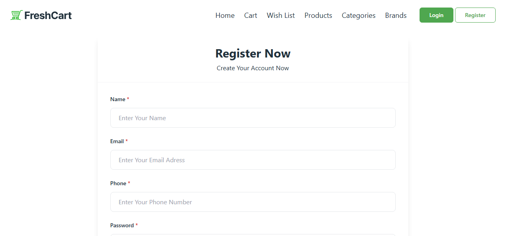
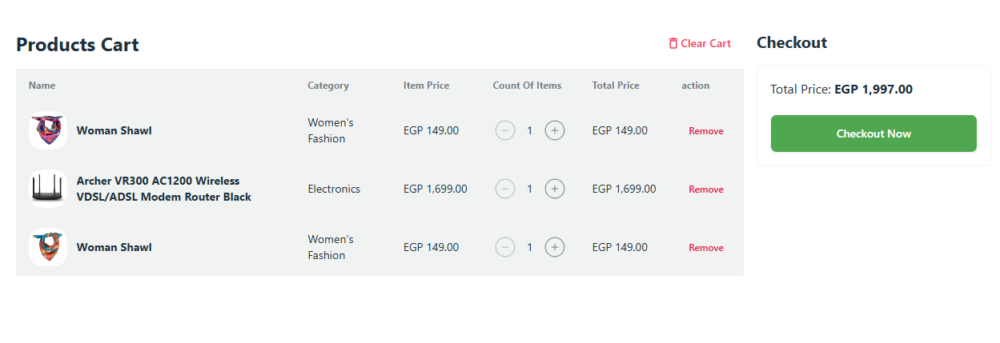

# Final Ecommerce Project

### Register / Login

### Product Details

### Home / Product

**Author:** Mohamed Ayman Omar  
**Year:** 2025  
**License:** © Mohamed Ayman Omar. All rights reserved.

---

## Description
Final Ecommerce هو مشروع متجر إلكتروني متكامل تم تطويره باستخدام React + Vite + TailwindCSS.  
المشروع يستخدم مكتبات حديثة لتسهيل التطوير وتحسين تجربة المستخدم، ويحتوي على صفحات متعددة تشمل المنتجات، الكارت، الـ Wishlist، Categories، Brands، والـ Checkout.

---

## Features
- **Products Listing:** عرض جميع المنتجات مع الأسعار والتقييمات.  
- **Product Details:** صفحة لكل منتج تحتوي على صور متعددة، السعر، التقييم، والوصف.  
- **Cart & Wishlist:** إضافة المنتجات للكارت أو الـ Wishlist مع تحديث تلقائي.  
- **Responsive Design:** يعمل على جميع الأجهزة من موبايل للكمبيوتر.  
- **Authentication:** تسجيل دخول وتسجيل مستخدم جديد.  
- **Form Validation:** باستخدام React Hook Form و Zod.  
- **Toast Notifications:** تنبيهات عند إضافة/حذف المنتجات أو حدوث خطأ.  
- **Loading States:** Skeletons للـ UI أثناء تحميل البيانات.  

---

## Libraries & Tools Used
- **React** – واجهة المستخدم  
- **Vite** – Build Tool سريع وخفيف  
- **TailwindCSS** – CSS Utility-first framework  
- **React Router DOM** – للتنقل بين الصفحات  
- **React Query (@tanstack/react-query)** – لجلب البيانات من API وإدارتها  
- **Redux Toolkit** – لإدارة حالة التطبيق (Cart, Wishlist, User)  
- **React Hook Form + Zod** – للتحقق من صحة النماذج  
- **Axios** – للتعامل مع API  
- **React Hot Toast** – لتنبيهات المستخدم  
- **React Icons** – أيقونات جاهزة  
- **Vercel** – لنشر المشروع وتشغيل الـ live demo  

---

## Project Structure
